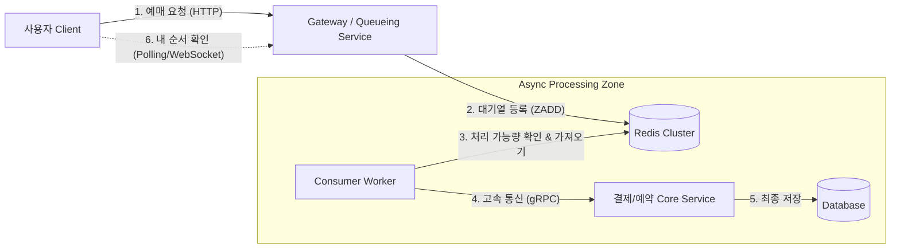

# Scenario 01: 대규모 트래픽 발생 시 순서 보장 및 유량 제어

## 1. 상황 정의 (Context)
- **상황:** 티켓 예매, 수강 신청, 선착순 특가 판매 등 특정 시간에 트래픽이 폭발적으로 몰리는 상황 (Burst Traffic).
- **요구사항:**
    1. **순서 보장:** 요청 들어온 순서대로 처리되어야 함 (FIFO).
    2. **시스템 보호:** 백엔드 서버와 DB가 감당할 수 있는 양만큼만 트래픽을 흘려보내야 함 (Backpressure).
    3. **사용자 경험:** 무한 로딩 대신 "대기 순번"을 안내하거나 빠른 응답을 줘야 함.

## 2. 핵심 문제 (Problem)
- 일반적인 RDB 트랜잭션으로 처리 시, `Lock` 경합으로 인한 DB CPU 급증 및 데드락 발생.
- 웹 서버(Tomcat 등)의 스레드 풀이 고갈되어 전체 서비스 마비.

## 3. 해결 전략: "The Dam" Architecture (비동기 대기열)

트래픽을 댐(Redis)에 일단 가둬두고, 수로(Worker)를 통해 발전소(DB)가 처리할 수 있는 만큼만 물을 흘려보내는 전략.

### 3.1 Architecture Overview

### 3.2 핵심 기술 및 도구 선정

| 구분                  | 기술/도구                  | 선정 이유                                                                                                                                                 |
|---------------------|------------------------|-------------------------------------------------------------------------------------------------------------------------------------------------------|
| **In-Memory Queue** | **Redis (Sorted Set)** | - **순서 보장:** `Score`를 Timestamp로 설정하여 완벽한 FIFO 구현 가능. - **고성능:** 단순 List보다 중복 제거 및 특정 순번 조회(`ZRANK`)에 유리. - **TTL:** 일정 시간 후 자동 만료시켜 좀비 데이터 방지. |
| **Internal Comm**   | **gRPC (Protobuf)**    | - **Worker ↔ Core 간 통신:** 대기열에서 꺼낸 데이터를 실제 로직 서버로 넘길 때 HTTP/JSON 대비 페이로드 크기가 작고 직렬화 속도가 빨라 내부 트래픽 부하 감소.                                              |
| **Algorithm**       | **Leaky Bucket**       | - **유량 제어:** 수도꼭지에서 물이 일정하게 떨어지듯, Worker가 1초에 처리할 수 있는 `TPS` 한계치만큼만 Redis에서 `Pop` 수행.                                                                 |

## 4. 상세 프로세스 (Flow)

### Step 1: 대기열 진입 (Enqueue)
- 사용자가 "예매하기" 버튼 클릭.
- API 서버는 DB를 거치지 않고 **Redis Sorted Set**에 `Key: UserID`, `Score: CurrentTimestamp`로 저장.
- **Response:** "현재 대기 순번은 1,500번째입니다." (DB 부하 0)

### Step 2: 유량 제어 및 소비 (Dequeue & Processing)
- **Worker (Scheduler/Daemon):**
    - 예: "1초마다 상위 100명씩 처리" 설정.
    - `ZRANGE`로 가장 오래된 요청 100개 가져옴.
    - `ZREM`으로 대기열에서 제거 (혹은 '처리 중' 상태로 이동).
- **Core Logic 호출 (gRPC):**
    - Worker가 가져온 100개의 요청을 **gRPC**를 통해 결제 서버로 비동기 요청.
    - gRPC의 `Streaming` 기능을 사용하면 대량의 처리를 파이프라이닝 할 수 있음.

### Step 3: 결과 통보
- 처리가 완료되면 별도의 `Notification Channel` (Redis Pub/Sub or Kafka)을 통해 사용자에게 성공/실패 알림.
- 클라이언트는 Polling 혹은 WebSocket으로 상태 확인 후 "결제 페이지"로 이동.

## 5. 고려사항 (Trade-offs)
- **Redis 다운 시:** 인메모리 데이터가 유실될 수 있음. -> *AOF/RDB 백업 정책 필수, 혹은 중요도가 매우 높다면 Kafka 고려 (단, Kafka는 순번 조회 기능 구현이 복잡함).*
- **Polling 부하:** 클라이언트가 순번 확인을 위해 너무 자주 요청을 보내면 Redis 조회 부하 발생. -> *조회 주기 조절(Exponential Backoff) 또는 WebSocket Push 방식 고려.*