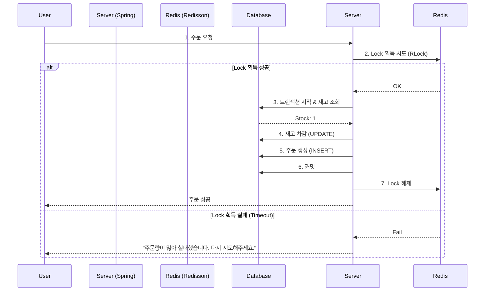

# Scenario 02: 재고 동시성 이슈 해결 (Race Condition Handling)

## 1. 상황 정의 (Context)
- **상황:** 선착순 이벤트, 한정판 판매 등에서 남은 재고보다 훨씬 많은 구매 요청이 동시에 들어오는 상황.
- **예시:** 재고가 딱 1개 남았는데, 0.01초 차이로 100명이 동시에 "구매" 버튼을 눌렀을 때.
- **목표:** 정확히 남은 수량만큼만 판매되어야 하며, 데이터 정합성이 깨지면 안 됨 (재고가 -1, -5가 되는 현상 방지).

## 2. 핵심 문제 (Problem: Lost Update)
일반적인 로직(`SELECT` -> `Application Logic` -> `UPDATE`)은 동시 요청 시 **갱신 손실(Lost Update)** 문제를 일으킴.

1. **User A**가 재고 조회 (Stock: 1)
2. **User B**가 재고 조회 (Stock: 1)
3. **User A**가 구매 후 차감 (UPDATE Stock=0)
4. **User B**도 (Stock이 1인 줄 알고) 구매 후 차감 (UPDATE Stock=0)
   -> **결과:** 재고는 0인데 주문은 2건 생성됨 (Over-selling 발생).

## 3. 해결 전략 (Solutions)

상황의 긴박함과 트래픽 규모에 따라 세 가지 전략 중 하나를 선택합니다.

### 3.1 Strategy A: DB Pessimistic Lock (비관적 락)
데이터베이스 레벨에서 Row에 물리적인 Lock을 걸어 다른 트랜잭션의 접근을 막는 방식.
- **SQL:** `SELECT ... FOR UPDATE`
- **장점:** 데이터 무결성이 가장 확실하게 보장됨.
- **단점:** Lock을 획득할 때까지 대기하므로 성능 저하가 심함. 데드락 위험 존재.
- **적합:** 트래픽이 적고 데이터 정합성이 최우선인 결제 시스템.

### 3.2 Strategy B: Redis Distributed Lock (분산 락)
서버가 여러 대일 때, 공통된 저장소(Redis)를 이용해 "자물쇠"를 선점한 서버만 로직을 수행하는 방식.
- **도구:** `Redisson` 라이브러리 (Java)
- **메커니즘:**
    1. `tryLock()` 시도.
    2. 성공 시 재고 조회 및 차감 로직 수행.
    3. 실패 시 일정 시간 대기 후 재시도(Spin Lock 방지를 위해 Pub/Sub 방식 사용).
    4. 로직 완료 후 `unlock()`.
- **장점:** DB 부하를 줄이고 애플리케이션 레벨에서 순차 처리 가능.
- **적합:** **분산 환경 서버, 적당한 트래픽의 선착순 이벤트.**

### 3.3 Strategy C: Redis Atomic Operations (최고 성능)
DB를 거치지 않고 Redis의 원자적 연산(`DECR`)만 사용하여 재고를 관리.
- **명령어:** `DECR product:1:stock`
- **로직:**
    1. Redis에서 `DECR` 수행.
    2. 반환값이 0 이상이면 성공 -> 추후 DB에 비동기 반영.
    3. 반환값이 음수면 실패(매진) -> `INCR`로 롤백.
- **장점:** 락이 필요 없고 가장 빠름.
- **단점:** RDB와의 데이터 싱크를 맞추는 추가 작업 필요.
- **적합:** **초대용량 트래픽, 단순 수량 차감 이벤트.**

## 4. Architecture Recommendation (Redisson 방식)

대부분의 실무 환경(분산 서버)에서 가장 범용적으로 쓰이는 **Redisson 분산 락** 구조입니다.

## 5. 구현 예시
- StockService.java

## 6. 결론 (Summary)
- **일반적인 상황** : Optimistic Lock (@Version) 사용.
- **트래픽이 많은 이벤트** : Redisson 분산 락 사용 권장.
- **극도로 많은 트래픽** : Redis DECR 후 비동기 처리 고려.