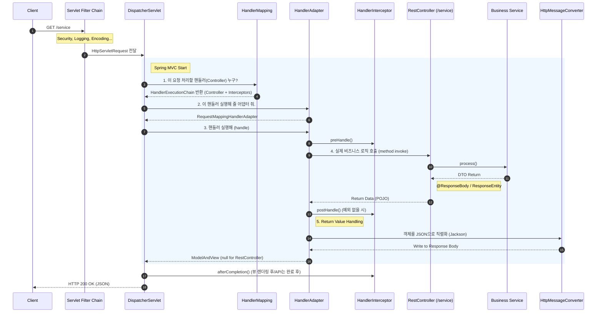

# Scenario 03: Spring Boot Request Lifecycle (Deep Dive)

## 1. 상황 정의 (Context)
- **상황:** Spring Boot로 개발된 API 서버에 클라이언트가 `/service`라는 API를 호출함.
- **궁금증:** 개발자가 작성한 `@Controller` 메서드에 도달하기까지, 그리고 `return` 값이 JSON으로 변환되어 나가기까지 내부적으로 어떤 컴포넌트들이 관여하는가?
- **목표:** '마법(Magic)'처럼 동작하는 Spring MVC의 내부 흐름을 파악하여, 에러 디버깅, 커스텀 필터/인터셉터 구현, 성능 튜닝 시 정확한 지점을 찾는다.

## 2. 핵심 구조 (Architecture)

Spring Web MVC는 **Front Controller 패턴**을 사용합니다. 모든 요청을 제일 앞에서 받아주는 문지기 역할인 `DispatcherServlet`이 핵심입니다.

### 2.1 Request Flow Diagram

## 3. 상세 프로세스 (Step-by-Step)

### Step 0: Servlet Filter (Spring 외부 ~ 진입부)
- `DispatcherServlet`에 도달하기 전에 웹 컨테이너(Tomcat) 레벨에서 실행됩니다.
- **주요 역할:** 인코딩(`CharacterEncodingFilter`), 보안(`SpringSecurityFilterChain`), CORS 처리.
- 여기서 막히면 Spring 로직은 실행조차 되지 않습니다.

### Step 1: DispatcherServlet (Front Controller)
- 모든 요청을 가장 먼저 받는 서블릿입니다. "이 요청을 처리하기 위해 누구를 불러야 하는가?"를 결정하고 조율합니다.

### Step 2: HandlerMapping (경로 탐색)
- 들어온 URL(`/service`)과 매핑된 컨트롤러 메서드(`@GetMapping("/service")`)를 찾습니다.
- **결과:** 단순히 컨트롤러만 찾는 게 아니라, 적용되어야 할 `Interceptor`들도 같이 묶어서 `HandlerExecutionChain`을 반환합니다.

### Step 3: HandlerAdapter (실행 위임)
- `DispatcherServlet`은 컨트롤러를 직접 실행하지 않습니다(컨트롤러의 타입이 다양할 수 있기 때문).
- 대신 해당 컨트롤러를 실행할 수 있는 `Adapter`를 찾아서 실행을 위임합니다. 일반적으로 `@RequestMapping` 기반은 `RequestMappingHandlerAdapter`가 담당합니다.

### Step 4: HandlerInterceptor (전/후 처리)
- **preHandle:** 컨트롤러 실행 직전 (로그인 체크 등).
- **postHandle:** 컨트롤러 실행 직후, 뷰 렌더링 전 (API에서는 잘 안 쓰임).
- **afterCompletion:** 모든 작업 완료 후 (리소스 정리 등).

### Step 5: Controller & Business Logic
- 드디어 개발자가 작성한 코드가 실행됩니다.
- Service, Repository를 거쳐 비즈니스 로직을 수행하고 결과 객체(DTO)를 반환합니다.

### Step 6: HttpMessageConverter (응답 변환)
- `@RestController` 또는 `@ResponseBody`가 붙어 있다면, `ViewResolver`(HTML 찾기) 대신 **`HttpMessageConverter`**가 동작합니다.
- 리턴된 Java 객체(DTO)를 HTTP 본문(JSON, XML 등)에 맞게 직렬화합니다. (기본 라이브러리: Jackson).

## 4. 핵심 요약 (Key Takeaways)
1. **Filter vs Interceptor:**
    - **Filter:** Spring Context 외부(앞단). HTTP 요청/응답의 로우 레벨 조작 (보안, 인코딩).
    - **Interceptor:** Spring Context 내부. 컨트롤러 실행 전후의 문맥(Context)에 접근 가능.
2. **반환 값 처리:**
    - HTML 응답: `ViewResolver`가 동작하여 `.jsp`, `.html`을 찾음.
    - API (JSON) 응답: `HttpMessageConverter`가 동작하여 객체를 JSON String으로 변환.
